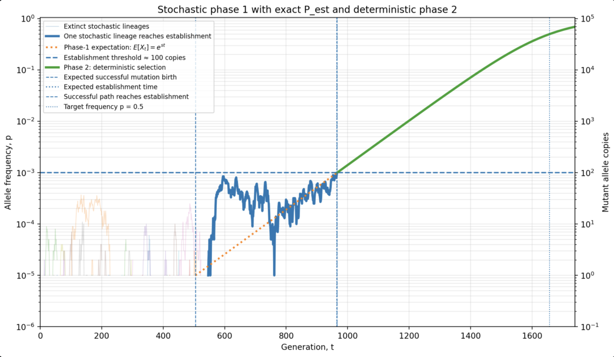

A two-phase model of a de novo beneficial mutation timeline. With
- initial population size $N_e$
- mutation selection coefficient $s$
- mutation rate $\mu$ (humans $\approx 10^{-8}$)
- target allele frequency $p$

it shows the expected number of generations to establish a mutation (against genetic drift) and grow that population to the desired allele frequency `p`. 

## Importance of population size $N_e$

In this [Dwarkesh interview](https://youtu.be/sRKBGVFVYAw?si=3-HM7qbEecfYNqal&t=3649) David Reich suggests that for human populations larger than $\approx 10^6$ "every mutation that can occur does occur within a couple of generations". This is off, and does not account for the genetic drift (i.e. initial stochasticity of the process) that kills most of beneficial mutants. Indeed, for such $N_e$ regardless of $s$ the time required for a mutation to successfully establish dominates:

$$
\frac{
\underbrace{\frac{1}{2N_e\mu P_{\text{est}}}}_{\text{waiting for successful mutant}}
+
\underbrace{\frac{\log(1/s)}{s}}_{\text{growth to establishment}}
}{
\underbrace{
\frac{1}{s}
\log\left(
\frac{p(1-p_{\text{est}})}
{p_{\text{est}}(1-p)}
\right)
}_{\text{deterministic growth to target}}
} > 1
$$

$$
P_{\text{est}}=\frac{1-e^{-2s}}{1-e^{-4N_es}}
$$

$$
p_{\text{est}}\approx\frac{1}{2N_es}
$$

as derived below. Example values:

| s | $N_e$ = $10^5$ | $N_e$ = $10^6$ | $N_e$ = $10^7$ | $N_e$ = $10^8$ | Breakpoint $N_e$ |
|---:|---:|---:|---:|---:|---:|
| 0.1 | 28.08 | 2.45 | 0.35 | 0.15 | $2.55 \cdot 10^6$ |
| 0.025 | 30.53 | 2.71 | 0.48 | 0.26 | $3.10 \cdot 10^6$ |
| 0.005 | 37.14 | 3.30 | 0.68 | 0.40 | $4.62 \cdot 10^6$ |


This model separates the timeline into two phases:

1. **Phase 1:** the beneficial mutation must appear and survive early genetic drift.
2. **Phase 2:** after establishment, the allele grows mainly by deterministic natural selection.

### Installation

```
conda env create -f environment.yml
conda activate allele
```

To run
```
streamlit run allele.py
```

### Phase 1: mutation supply and escape from drift

A new beneficial mutation begins as one allele copy. In a diploid population, there are approximately:

$$
2N_e
$$

allele copies, so new beneficial mutant copies appear at rate:

$$
2N_e\mu
$$

per generation.

Most new beneficial mutations are lost by genetic drift. The establishment probability is:

$$
P_{\text{est}}
=
\frac{1-e^{-2s}}{1-e^{-4N_es}}
$$

So the rate at which successful beneficial mutations appear is:

$$
2N_e\mu P_{\text{est}}
$$

and the expected waiting time for a successful mutation is:

$$
T_{\text{wait}}
=
\frac{1}{2N_e\mu P_{\text{est}}}
$$

Once a future-successful mutation appears, its expected early copy-number growth is:

$$
\mathbb{E}[X_t] = e^{st}
$$

where $X_t$ is the mutant allele copy count.

The establishment threshold is approximated as:

$$
X_{\text{est}} \approx \frac{1}{s}
$$

So the expected time from appearance to establishment is:

$$
T_{\text{appear}\to\text{est}}
=
\frac{\log(1/s)}{s}
$$

Thus the full early phase is approximately:

$$
T_{\text{phase 1}}
\approx
\frac{1}{2N_e\mu P_{\text{est}}}
+
\frac{\log(1/s)}{s}
$$

In asymptotic notation:

$$
T_{\text{phase 1}}
=
O\left(
\frac{1}{N_e\mu P_{\text{est}}}
+
\frac{\log(1/s)}{s}
\right)
$$

Using the common large-population approximation $P_{\text{est}} \approx 2s$, this becomes:

$$
T_{\text{phase 1}}
=
O\left(
\frac{1}{N_e\mu s}
+
\frac{\log(1/s)}{s}
\right)
$$

Phase 1 is therefore governed by mutation supply, establishment probability, and early stochastic survival.

### Phase 2: deterministic growth after establishment

After establishment, the allele is common enough that genetic drift is less dominant. Its frequency is modeled by deterministic selection:

$$
\frac{dp}{dt} = sp(1-p)
$$

where:

- $p$ is allele frequency,
- $s$ is the selection coefficient,
- $t$ is time in generations.

The time to grow from establishment frequency $p_{\text{est}}$ to target frequency $p$ is:

$$
T_{\text{phase 2}}
=
\frac{1}{s}
\log\left(
\frac{p(1-p_{\text{est}})}
{p_{\text{est}}(1-p)}
\right)
$$

The key scaling is the leading factor:

$$
\frac{1}{s}
$$

So, for fixed target frequency, the second phase is approximately:

$$
T_{\text{phase 2}}
\approx
O\left(\frac{1}{s}\right)
$$

This means the deterministic growth phase is mostly controlled by selection strength. If $s$ doubles, the allele spreads roughly twice as fast. If $s$ is cut in half, the spread takes roughly twice as long.

### Summary

Phase 1:

$$
T_{\text{phase 1}}
=
O\left(
\frac{1}{N_e\mu P_{\text{est}}}
+
\frac{\log(1/s)}{s}
\right)
$$

or, when $P_{\text{est}} \approx 2s$:

$$
T_{\text{phase 1}}
=
O\left(
\frac{1}{N_e\mu s}
+
\frac{\log(1/s)}{s}
\right)
$$

Phase 2:

$$
T_{\text{phase 2}}
\approx
O\left(\frac{1}{s}\right)
$$

So the initial phase is limited by mutation supply and stochastic establishment, while the later growth phase is primarily selection-limited.